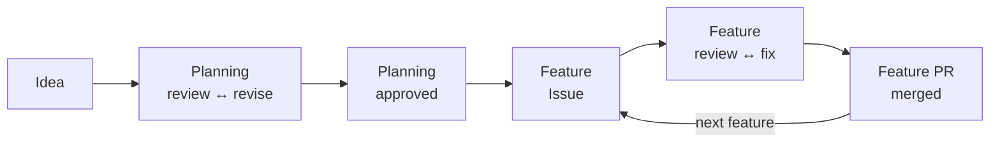

# Agentic Coding Template

A lightweight, model-agnostic repository template for agentic software engineering. It applies the useful parts of GH-600 at individual/small-team scale: plan → act → evaluate, GitHub as control plane, isolated execution, explicit agent contracts, risk-based autonomy, evidence, independent review, CI, and human gates for high-risk actions.

## How it works

A project goes from an idea to merged features in two phases, each with an
independent, read-only review loop and explicit human approvals.



- [Workflow](docs/workflow.md): the workflow in flow, artifact, and reference views.
- [Worked example](docs/example.md): a complete run with a sample project.
- [Development](docs/development.md): every command and its options.
- [Project map](docs/project-map.md): what each file in the template is for.

## Start a new project

1. Create a repository from this template, complete `docs/repository-setup.md`,
   and check your machine with `./scripts/doctor.sh`.
2. Set the provider and model of each role in `.agents/agents.conf`.
3. Plan the project in a planning worktree:

   ```bash
   ./scripts/start-planning.sh --description path/to/idea.md
   cd ../<repository>-planning-project-bootstrap
   ./scripts/review-planning.sh
   ./scripts/revise-planning.sh --review .agents/reviews/planning-project-bootstrap-review-01.json
   ./scripts/review-planning.sh    # again after each revision, until it passes
   ./scripts/finish-planning.sh
   ```

   Commit, push, and merge the planning PR as `finish-planning.sh` shows, then
   remove the planning worktree with
   `./scripts/cleanup-worktree.sh planning/project-bootstrap`.
4. For each roadmap feature, from the primary checkout and then the feature
   worktree:

   ```bash
   ./scripts/create-feature-issue.sh F01
   ./scripts/start-feature.sh 12 recipes    # the name is optional
   cd ../<repository>-12-recipes
   ./scripts/review-feature.sh 12
   ./scripts/triage-review.sh .agents/reviews/feature-12-recipes-review-01.json
   ./scripts/apply-triage.sh .agents/triage/feature-12-recipes-review-01-triage.json
   ./scripts/review-feature.sh 12    # again after fixes; --changes reviews only the fix
   ./scripts/finish-feature.sh 12 "Add recipes"
   ./scripts/publish-feature.sh 12   # push and open the pull request
   ```

   Or let one command run those steps, from `start-feature.sh` up to the
   open pull request, without questions:

   ```bash
   ./scripts/run-feature.sh 12
   ```

   Its agents run unattended and the triage is approved without you; read
   "Running a feature with one command" in `docs/development.md` before you
   use it.

   Merge the pull request after its checks passed, and remove the
   worktree from the primary checkout with
   `./scripts/cleanup-worktree.sh 12`, or all merged worktrees at once with
   `./scripts/cleanup-worktree.sh --merged`.

## While a project runs

- **A session ended early:** `./scripts/start-feature.sh 12 --resume` starts a
  new implementer session in the existing worktree.
- **A new feature, a changed requirement, another technical direction:**
  `./scripts/start-planning.sh <name> --change <file>` runs a change cycle on
  the approved planning, with the same review and approval.
- **A small amendment of the architecture or an ADR:**
  `./scripts/finish-planning.sh --amend "<reason>"` approves it without a
  review round.

See "Changing an approved planning" and "Resuming an interrupted feature" in
[Development](docs/development.md).

## Keep a project up to date

A project is a copy of this template. To take over later improvements of the
workflow, run `./scripts/sync-template.sh` in the project: it replaces the
workflow files the project did not change, merges the ones it did, and leaves
everything else alone. See "Taking over template changes" in
[Development](docs/development.md).

Rules for agents are in `AGENTS.md`; boundaries are in `.agents/policies/`.
